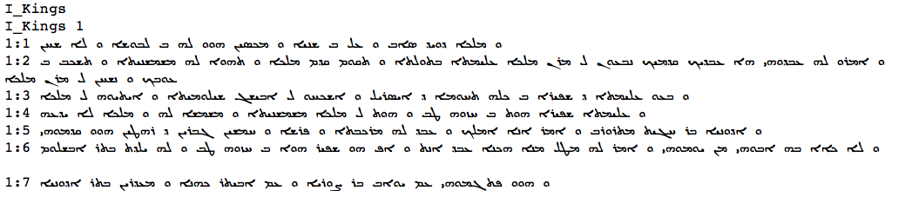

# CALAP

**About CALAP**. CALAP stands for Computer-Assisted Linguistic Analysis of the
Peshitta.
CALAP was a [project](https://openaccess.leidenuniv.nl/handle/1887/10866) at the
University of Leiden.
The [Peshitta](http://en.wikipedia.org/wiki/Peshitta) is a collection of Syriac
texts. According to Wikipedia it is the standard version of the Bible in
churches of the Syriac tradition. Resources can be found on
[peshitta.org](http://www.peshitta.org).

The text we use below comes from the [Peshitta Institute
Leiden](http://www.hum.leiden.edu/religion/research/peshitta-institute/peshitta-
institute.html), and has been prepared as an EMDROS database, which is now held
by the [ETCBC](http://www.godgeleerdheid.vu.nl/etcbc).

From there is has been converted to
[LAF](http://www.iso.org/iso/catalogue_detail.htm?csnumber=37326)
by Dirk Roorda, and this notebook accesses this LAF data by means of
[LAF-Fabric](http://laf-fabric.readthedocs.org/en/latest/).

# Text from features

Here comes the plain text of the CALAP data.

The CALAP database only contains the surface consonants as textual
representation.

    import sys
    import collections
    
    from etcbc.lib import Transcription
    from laf.fabric import LafFabric
    fabric = LafFabric()

      0.00s This is LAF-Fabric 4.2.6
    http://laf-fabric.readthedocs.org/texts/API-reference.html

    fabric.load('calap', '--', 'plain', {
        "xmlids": {"node": False, "edge": False},
        "features": ('''
            otype
            surface_consonants
            psp
            book chapter verse verse_label
        ''',''),
        "primary": True,
    })
    exec(fabric.localnames.format(var='fabric'))

      0.00s LOADING API: please wait ... 
      0.00s INFO: DATA COMPILED AT: 2014-05-06T14-03-13
      0.27s LOGFILE=/Users/dirk/laf-fabric-data/calap/tasks/plain/__log__plain.txt
      0.27s INFO: DATA LOADED FROM SOURCE calap AND ANNOX -- FOR TASK plain

    plain_file = outfile("calap_plain.txt")
    
    tr = Transcription()
    catalog = set()
    for i in F.otype.s('word'):
        sf = F.surface_consonants.v(i)
        for x in sf: catalog.add(x)
        the_text = tr.to_syriac(sf)
        plain_file.write(the_text + ' ')
    
    plain_file.close()
    print(','.join(sorted(catalog)))

    <,>,B,C,D,G,H,J,K,L,M,N,P,Q,R,S,T,V,W,X,Y,Z

This file does not have newlines, it is a blob of consonant transcriptions for
each word separated by spaces.

## Passage indicators

If you want books, chapters and verses marked, you can achieve it in the
following way:

    plainx_file = outfile("calap_plainx.txt")
    
    the_book = None
    the_chapter = None
    the_verse = None
    
    for i in NN():
        this_type = F.otype.v(i)
        if this_type == "word":
            the_text = tr.to_syriac(F.surface_consonants.v(i))
            the_suffix = ' '
            plainx_file.write(the_text + the_suffix)
        elif this_type == "book":
            the_book = F.book.v(i)
            sys.stderr.write("\r{:>6} {:<30}".format(i, the_book)) 
            plainx_file.write("\n{}".format(the_book))
        elif this_type == "chapter":
            the_chapter = F.chapter.v(i)
            plainx_file.write("\n{} {}".format(the_book, the_chapter))
        elif this_type == "verse":
            the_verse = F.verse.v(i)
            plainx_file.write("\n{}:{} ".format(the_chapter, the_verse))
    sys.stderr.write("\n")
    
    plainx_file.close()

    141613 Sirach                        

In order to show the syriac text, you need to install a font that has glyphs for
the syriac unicode characters (0700 - 074F).
For example: Estrangelo Edessa from
[Meltho](http://www.bethmardutho.org/index.php/resources/fonts.html).

    !head -n 10 {my_file('calap_plainx.txt')}

    
    I_Kings
    I_Kings 1
    1:1 ܘ ܡܠܟܐ ܕܘܝܕ ܣܐܒ ܘ ܥܠ ܒ ܫܢܝܐ ܘ ܡܟܣܝܢ ܗܘܘ ܠܗ ܒ ܠܒܘܫܐ ܘ ܠܐ ܫܚܢ 
    1:2 ܘ ܐܡܪܘ ܠܗ ܥܒܕܘܗܝ ܗܐ ܥܒܕܝܟ ܩܕܡܝܟ ܢܒܥܘܢ ܠ ܡܪܢ ܡܠܟܐ ܥܠܝܡܬܐ ܒܬܘܠܬܐ ܘ ܬܩܘܡ ܩܕܡ ܡܠܟܐ ܘ ܬܗܘܐ ܠܗ ܡܫܡܫܢܝܬܐ ܘ ܬܫܟܒ ܒ ܥܘܒܟ ܘ ܢܫܚܢ ܠ ܡܪܢ ܡܠܟܐ 
    1:3 ܘ ܒܥܘ ܥܠܝܡܬܐ ܕ ܫܦܝܪܐ ܒ ܟܠܗ ܬܚܘܡܐ ܕ ܐܝܣܪܝܠ ܘ ܐܫܟܚܘ ܠ ܐܒܝܫܓ ܫܝܠܘܡܝܬܐ ܘ ܐܝܬܝܘܗ ܠ ܡܠܟܐ 
    1:4 ܘ ܥܠܝܡܬܐ ܫܦܝܪܐ ܗܘܬ ܒ ܚܙܘܗ ܛܒ ܘ ܗܘܬ ܠ ܡܠܟܐ ܡܫܡܫܢܝܬܐ ܘ ܡܫܡܫܐ ܠܗ ܘ ܡܠܟܐ ܠܐ ܝܕܥܗ 
    1:5 ܘ ܐܕܘܢܝܐ ܒܪ ܚܓܝܬ ܡܬܪܘܪܒ ܘ ܐܡܪ ܐܢܐ ܐܡܠܟ ܘ ܥܒܕ ܠܗ ܡܪܟܒܬܐ ܘ ܦܪܫܐ ܘ ܚܡܫܝܢ ܓܒܪܝܢ ܕ ܪܗܛܝܢ ܗܘܘ ܩܕܡܘܗܝ 
    1:6 ܘ ܠܐ ܟܐܐ ܒܗ ܐܒܘܗܝ ܡܢ ܝܘܡܘܗܝ ܘ ܐܡܪ ܠܗ ܡܛܠ ܡܢܐ ܗܟܢܐ ܥܒܕ ܐܢܬ ܘ ܐܦ ܗܘ ܫܦܝܪ ܗܘܐ ܒ ܚܙܘܗ ܛܒ ܘ ܠܗ ܝܠܕܬ ܒܬܪ ܐܒܫܠܘܡ 
    1:7 ܘ ܗܘܘ ܦܬܓܡܘܗܝ ܥܡ ܝܘܐܒ ܒܪ ܨܘܪܝܐ ܘ ܥܡ ܐܒܝܬܪ ܟܗܢܐ ܘ ܡܥܕܪܝܢ ܒܬܪ ܐܕܘܢܝܐ 

If you are in an environment where you do not have this font installed, see the
screenshot at the top screenshot.

## Verse list

We can get the text in a quite different way: just read it from the *primary
data*.

Let us do that per verse.

    verse_file = outfile("calap_verses.txt")
    
    for i in F.otype.s('verse'):
        the_text = tr.to_syriac(''.join([txt for (j, txt) in P.data(i)]))
        the_verse = F.verse_label.v(i)
        verse_file.write("{}\n{}\n".format(the_verse, the_text))
    
    verse_file.close()

    !head -n 10 {my_file('calap_verses.txt')}

    1R 1,1
    ܘ ܡܠܟܐ ܕܘܝܕ ܣܐܒ ܘ ܥܠ ܒ ܫܢܝܐ ܘ ܡܟܣܝܢ ܗܘܘ ܠܗ ܒ ܠܒܘܫܐ ܘ ܠܐ ܫܚܢ 
    1R 1,2
    ܘ ܐܡܪܘ ܠܗ ܥܒܕܘܗܝ ܗܐ ܥܒܕܝܟ ܩܕܡܝܟ ܢܒܥܘܢ ܠ ܡܪܢ ܡܠܟܐ ܥܠܝܡܬܐ ܒܬܘܠܬܐ ܘ ܬܩܘܡ ܩܕܡ ܡܠܟܐ ܘ ܬܗܘܐ ܠܗ ܡܫܡܫܢܝܬܐ ܘ ܬܫܟܒ ܒ ܥܘܒܟ ܘ ܢܫܚܢ ܠ ܡܪܢ ܡܠܟܐ 
    1R 1,3
    ܘ ܒܥܘ ܥܠܝܡܬܐ ܕ ܫܦܝܪܐ ܒ ܟܠܗ ܬܚܘܡܐ ܕ ܐܝܣܪܝܠ ܘ ܐܫܟܚܘ ܠ ܐܒܝܫܓ ܫܝܠܘܡܝܬܐ ܘ ܐܝܬܝܘܗ ܠ ܡܠܟܐ 
    1R 1,4
    ܘ ܥܠܝܡܬܐ ܫܦܝܪܐ ܗܘܬ ܒ ܚܙܘܗ ܛܒ ܘ ܗܘܬ ܠ ܡܠܟܐ ܡܫܡܫܢܝܬܐ ܘ ܡܫܡܫܐ ܠܗ ܘ ܡܠܟܐ ܠܐ ܝܕܥܗ 
    1R 1,5
    ܘ ܐܕܘܢܝܐ ܒܪ ܚܓܝܬ ܡܬܪܘܪܒ ܘ ܐܡܪ ܐܢܐ ܐܡܠܟ ܘ ܥܒܕ ܠܗ ܡܪܟܒܬܐ ܘ ܦܪܫܐ ܘ ܚܡܫܝܢ ܓܒܪܝܢ ܕ ܪܗܛܝܢ ܗܘܘ ܩܕܡܘܗܝ 

## Empty words

In the BHS there are words that have an empty representation.

Let us have a closer look to the CALAP.
Are there empty words?

    ewords = collections.defaultdict(lambda: [])
    verse = None
    
    for i in NN(test=F.otype.v, values=['verse', 'word']):
        if F.otype.v(i) == 'verse':
            verse = i
            continue
        text = F.surface_consonants.v(i)
        if text == '':
            lex = lexeme.v(i)
            pos = F.psp.v(i)
            ewords[(lex, pos)].append(verse)
    
    for (item, occs) in sorted(ewords.items(), key=lambda x: (-len(x[1]), x[0][1], x[0][0])):
        print("{:>6} x {:<15} = {:>10} in {}{}".format(
            len(occs), 
            item[1], 
            item[0], 
            "; ".join([F.verse_label.v(j) for j in occs][0:5]),
            ' ...' if len(occs) > 20 else '',
        ))
    if not len(ewords):
        print("No empty words found")

    No empty words found

    close()

        35s Results directory:
    /Users/dirk/laf-fabric-data/calap/tasks/plain
    
    .DS_Store                              6148 Thu Apr 17 18:26:31 2014
    __log__plain.txt                        181 Wed May  7 07:30:41 2014
    calap_plain.txt                      380716 Wed May  7 07:30:11 2014
    calap_plainx.txt                     399490 Wed May  7 07:30:16 2014
    calap_verses.txt                     408012 Wed May  7 07:30:26 2014

    
